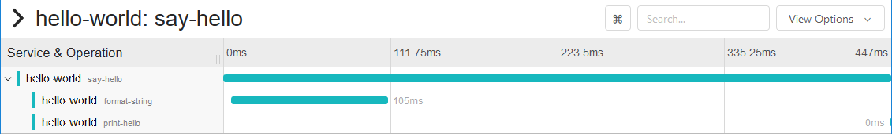
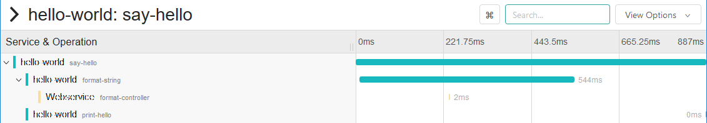
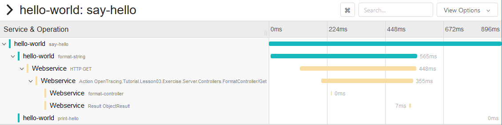

# Lesson 3 - Tracing HTTP Requests

## Objectives

Learn how to:

* Trace a transaction across more than one microservice
* Pass the context between processes using `Inject` and `Extract`
* Apply OpenTracing-recommended tags

## Walkthrough

### Hello-World Microservice App

For this lesson we are going to need a client and server component. To get started, please create
a command line project, similar to the previous lessons. Additionally, create a "ASP .NET Core Web Application"
with the "API" template. Make sure to add the reference to our `OpenTracing.Tutorial.Library` library to both projects. and
copy the `HelloActive.cs` file from the previous lesson into the client solution replacing the automatically
created `Program.cs`. Make some slight changes to have the App call the API instead of doing the string formatting
work locally:

```csharp
...
using System.Net;

namespace OpenTracing.Tutorial.Lesson03.Exercise.Client
{
    internal class HelloActive
    {
        private readonly ITracer _tracer;
        private readonly WebClient _webClient = new WebClient();

        private string FormatString(string helloTo)
        {
            using (var scope = _tracer.BuildSpan("format-string").StartActive(true))
            {
                var url = $"http://localhost:8081/api/format/{helloTo}";
                var helloString = _webClient.DownloadString(url);
                scope.Span.Log(new Dictionary<string, object>
                {
                    [LogFields.Event] = "string.Format",
                    ["value"] = helloString
                });
                return helloString;
            }
        }
    ...
    }
}
```

For the server REST API part, let's reproduce the functionality of `FormatString`. Rename the `ValueController` 
to `FormatController` and adjust it to the example code below:

```csharp
using Microsoft.AspNetCore.Mvc;

namespace OpenTracing.Tutorial.Lesson03.Exercise.Server.Controllers
{
    [Route("api/[controller]")]
    public class FormatController : Controller
    {
        // GET: api/format
        [HttpGet]
        public string Get()
        {
            return "Hello!";
        }

        // GET: api/format/helloString
        [HttpGet("{helloString}", Name = "GetFormat")]
        public string Get(string helloString)
        {
            var formattedHelloString = $"Hello, {helloString}!";
            return formattedHelloString;
        }
    }
}
```

To have the server app on the port 8081, we have to adjust the `Properties/launchSettings.json` file. Make sure, 
that all `applicationUrl` entries have the value `http://localhost:8081/`.

Start the server app and access the endpoint directly:

```powershell
$ curl http://localhost:8081/api/format/Bryan
```

Executing the client still produces the same threes spans as in the previous lesson, meaning we
have no traces for the server side:



### Inter-Process Context Propagation

Since the only change we made in the `Hello.cs` app was to replace two operations with HTTP calls,
the tracing story remains the same - we get a trace with three spans, all from `hello-world` service.
But now we have two more microservices participating in the transaction and we want to see them
in the trace as well. In order to continue the trace over the process boundaries and HTTP calls,
we need a way to propagate the span context over the wire. The OpenTracing API provides two functions
in the Tracer interface to do that, `Inject(spanContext, format, carrier)` and `Extract(format, carrier)`.

The `format` parameter refers to one of the three standard encodings the OpenTracing API defines:
  * `TEXT_MAP` where span context is encoded as a collection of string key-value pairs,
  * `BINARY` where span context is encoded as an opaque byte array,
  * `HTTP_HEADERS`, which is similar to `TEXT_MAP` except that the keys must be safe to be used as HTTP headers.

The `carrier` is an abstraction over the underlying RPC framework. For example, a carrier for `TEXT_MAP`
format is an interface that allows the tracer to write key-value pairs via `Add(key, value)` method,
while a carrier for Binary format is simply a `byte[]`.

The tracing instrumentation uses `Inject` and `Extract` to pass the span context through the network calls.

### Instrumenting the Client

In the `FormatString` function we already create a child span. In order to pass its context over the HTTP
request we need to call `_tracer.Inject` before building the HTTP request:

```csharp
var span = scope.Span
    .SetTag("span.kind", "client")  // or: Tags.SpanKind.Set(span, Tags.SpanKindClient);
    .SetTag("http.method", "GET")   // or: Tags.HttpMethod.Set(span, "GET");
    .SetTag("http.url", url);       // or: Tags.HttpUrl.Set(span, url);

var dictionary = new Dictionary<string, string>();
_tracer.Inject(span.Context, BuiltinFormats.HttpHeaders, new TextMapInjectAdapter(dictionary));
foreach (var entry in dictionary)
    _webClient.Headers.Add(entry.Key, entry.Value);
```

Notice that we also add a couple additional tags to the span with some metadata about the HTTP request,
and we mark the span with a `span.kind=client` tag, as recommended by the OpenTracing
[Semantic Conventions][semantic-conventions]. There are other tags we could add. All of the recommended tags 
are specified in `OpenTracing.Tag.Tags` for easier usage as shown above.

### Instrumenting the Server manually

Our server is currently not instrumented for tracing. We need to do the following:

#### Create an instance of a Tracer, similar to how we did it in `Hello.cs`

Add a tracer property to the `Startup` class:

```csharp
private static readonly Tracer Tracer = Tracing.Init("Webservice");
```

Register the tracer and add it to the services, making it available globally through Dependency Injection:

```csharp
public void ConfigureServices(IServiceCollection services)
{
    services.AddMvc();

    services.AddSingleton<ITracer, Tracer>(t => Tracer);
}
```

And dispose of it during application shutdown:

```csharp
public void Configure(IApplicationBuilder app, IHostingEnvironment env, IApplicationLifetime applicationLifetime)
{
    if (env.IsDevelopment())
    {
        app.UseDeveloperExceptionPage();
    }

    applicationLifetime.ApplicationStopping.Register(Tracer.Dispose);
    app.UseMvc();
}
```

Add a member variable and a constructor to the `FormatController`. The `ITracer` will be supplied using 
Dependency Injection:

```csharp
private readonly ITracer _tracer;

public FormatController(ITracer tracer)
{
    _tracer = tracer;
}
```

#### Extract the span context from the incoming request using `ITracer.Extract`

First, add a helper function:

```csharp
public static IScope StartServerSpan(ITracer tracer, IDictionary<string, string> headers, string operationName)
{
    ISpanBuilder spanBuilder;
    try
    {
        ISpanContext parentSpanCtx = tracer.Extract(BuiltinFormats.HttpHeaders, new TextMapExtractAdapter(headers));

        spanBuilder = tracer.BuildSpan(operationName);
        if (parentSpanCtx != null)
        {
            spanBuilder = spanBuilder.AsChildOf(parentSpanCtx);
        }
    }
    catch (Exception)
    {
        spanBuilder = tracer.BuildSpan(operationName);
    }

    // TODO could add more tags like http.url
    return spanBuilder.WithTag(Tags.SpanKind.Key, Tags.SpanKindServer).StartActive(true);
}
```

The logic here is similar to the client side instrumentation, except that we are using `_tracer.Extract`
and tagging the span as `span.kind=server`. We are extracting the headers via `TextMapExtractAdapter`.

Now change the `/api/format/helloString` handler method to use `StartServerSpan`:

```csharp
[HttpGet("{helloString}", Name = "GetFormat")]
public string Get(string helloString)
{
    var headers = Request.Headers.ToDictionary(k => k.Key, v => v.Value.First());
    using (var scope = StartServerSpan(_tracer, headers, "format-controller"))
    {
        var formattedHelloString = $"Hello, {helloString}!";
        scope.Span.Log(new Dictionary<string, object>
        {
            [LogFields.Event] = "string-format",
            ["value"] = formattedHelloString
        });
        return formattedHelloString;
    }
}
```

### Take It For a Spin

As before, first run the `Lesson03.Exercise.Server` project in Visual Studio.
Then run `Lesson03.Exercise.Client` in the terminal. You should see an output like this:

Server output (ASP.NET Core Web Server):

```powershell
info: Jaeger.Core.Reporters.LoggingReporter[0]
Reporting span:
{
    "Context": {
        "TraceId": { "High": 15765884733735375433, "Low": 8792954367037605704 },
        ...
    },
    ...
    "References": [
        {
        "Type": "child_of",
        "Context": {
            "TraceId": { "High": 15765884733735375433, "Low": 8792954367037605704 },
            ...
            }
        }
    ],
    ...
}
info: Jaeger.Core.Reporters.LoggingReporter[0]
Reporting span:
{
    "Context": {
        "TraceId": { "High": 15765884733735375433, "Low": 8792954367037605704 },
        ...
    },
    ...
    "References": [
        {
        "Type": "child_of",
        "Context": {
            "TraceId": { "High": 15765884733735375433, "Low": 8792954367037605704 },
            ...
            }
        }
    ],
    ...
}
info: Jaeger.Core.Reporters.LoggingReporter[0]
Reporting span:
{
    "Context": {
        "TraceId": { "High": 15765884733735375433, "Low": 8792954367037605704 },
        ...
    },
    ...
    "References": [
        {
        "Type": "child_of",
        "Context": {
            "TraceId": { "High": 15765884733735375433, "Low": 8792954367037605704 },
            ...
            }
        }
    ],
    ...
}
info: Jaeger.Core.Reporters.LoggingReporter[0]
Reporting span:
{
    "Context": {
        "TraceId": { "High": 15765884733735375433, "Low": 8792954367037605704 },
        ...
    },
    ...
}
```

Client terminal output:

```powershell
info: Jaeger.Core.Reporters.LoggingReporter[0]
Reporting span:
{
    "Context": {
        "TraceId": { "High": 15765884733735375433, "Low": 8792954367037605704 },
        ...
    },
    ...
}
Hello, Bryan!
info: Jaeger.Core.Reporters.LoggingReporter[0]
Reporting span:
{
    "Context": {
        "TraceId": { "High": 15765884733735375433, "Low": 8792954367037605704 },
        ...
    },
    ...
}

info: Jaeger.Core.Reporters.LoggingReporter[0]
Reporting span:
{
    "Context": {
        "TraceId": { "High": 15765884733735375433, "Low": 8792954367037605704 },
        ...
    },
    ...
}
```

Note how all recorded spans show the same trace ID
`{ "High": 15765884733735375433, "Low": 8792954367037605704, "IsValid": true }`.
This is a sign of correct instrumentation. It is also a very useful debugging approach when something
is wrong with tracing. A typical error is to miss the context propagation somwehere,
either in-process or inter-process, which results in different trace IDs and broken
traces.

If we open this trace in the UI, we see all spans across client _and_ server.



### Instrumenting the Server using `OpenTracing.Contrib.NetCore`

Our server is currently instrumented manually for tracing. This needs a lot of manual work. 
To make the usage a lot easier, we need to do the following:

#### Add NuGet package for instrumentation

Add the NuGet package `OpenTracing.Contrib.NetCore` to not manually instrument the code.

#### Adjust the `Startup` class

We previously used `services.AddSingleton` to register the tracers. `AddOpenTracing` also initializes the 
`ITracer` singleton for Dependency Injection using the `GlobalTracer.Instance` instance:

```csharp
public void ConfigureServices(IServiceCollection services)
{
    services.AddMvc();

    GlobalTracer.Register(Tracer);
    services.AddOpenTracing();
}
```

#### Adjust the `FormatController` class

Previously we added the `StartServerSpan` helper which needed to extract the rootSpan from the headers. Since 
this is always the case when using ASP.NET Core, this has not to be done manually as it is done by the middleware. 
We can just use the span builder with the active span as we did on the client side.

```csharp
// GET: api/format/helloString
[HttpGet("{helloString}", Name = "GetFormat")]
public string Get(string helloString)
{
    using (var scope = _tracer.BuildSpan("format-controller").StartActive(true))
    {
        ...
    }
}
```

Just by adding OpenTracing to the active services we already get a lot of tracing for free.
Starting the server and making a request through the client adds a couple of additional spans:



## Conclusion

The complete program can be found in the [solution](./solution) package.

Next lesson: [Baggage](../lesson04).

[semantic-conventions]: https://github.com/opentracing/specification/blob/master/semantic_conventions.md
