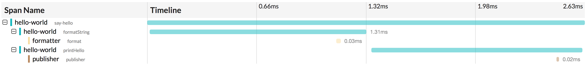

# Lesson 3 - Tracing RPC Requests

## Objectives

Learn how to:

* Trace a transaction across more than one microservice
* Pass the context between processes using `Inject` and `Extract`
* Apply OpenTracing-recommended tags

## Walkthrough

### Hello-World Microservice App

To save you some typing, we are going to start this lesson with a partial solution
available in the [exercise](./exercise) package. We are still working with the same
Hello World application, except that the `format_string` and `print_hello` functions
are now rewritten as RPC calls to two downstream services, `formatter` and `publisher`.
The package is organized as follows:

  * `hello.py` is a copy from Lesson 2 modified to make HTTP calls
  * `formatter.py` is a Flask-based HTTP server that responds to a request like
    `GET 'http://localhost:8081/format?helloTo=Bryan'` and returns `"Hello, Bryan!"` string
  * `publisher.py` is another HTTP server that responds to requests like
     `GET 'http://localhost:8082/publish?helloStr=hi%20there'` and prints `"hi there"` string to stdout.

To test it out, run the formatter and publisher services in separate terminals

```
# terminal 2
$ python -m lesson03.exercise.formatter
 * Running on http://127.0.0.1:8081/ (Press CTRL+C to quit)

# terminal 3
$ python -m lesson03.exercise.publisher
 * Running on http://127.0.0.1:8082/ (Press CTRL+C to quit)
```

Execute an HTTP request against the formatter:

```
$ curl 'http://localhost:8081/format?helloTo=Bryan'
Hello, Bryan!%
```

Execute and HTTP request against the publisher:

```
$ curl 'http://localhost:8082/publish?helloStr=hi%20there'
published
```

The publisher stdout will show `"hi there"`.

Finally, if we run the client app as we did in the previous lessons:

```
$ python -m lesson03.exercise.hello Bryan
Initializing Jaeger Tracer with UDP reporter
Using sampler ConstSampler(True)
opentracing.tracer initialized to <jaeger_client.tracer.Tracer object at 0x1065eae90>[app_name=hello-world]
Starting new HTTP connection (1): localhost
http://localhost:8081 "GET /format?helloTo=Bryan HTTP/1.1" 200 13
Reporting span 54a7216ce30dc55f:7da1880708474f6b:54a7216ce30dc55f:1 hello-world.format
Starting new HTTP connection (1): localhost
http://localhost:8082 "GET /publish?helloStr=Hello%2C+Bryan%21 HTTP/1.1" 200 9
Reporting span 54a7216ce30dc55f:e1f600c35cf37186:54a7216ce30dc55f:1 hello-world.println
Reporting span 54a7216ce30dc55f:54a7216ce30dc55f:0:1 hello-world.say-hello
```

We will see the `publisher` printing the line `"Hello, Bryan!"`.

### Inter-Process Context Propagation

Since the only change we made in the `hello.py` app was to replace two operations with HTTP calls,
the tracing story remains the same - we get a trace with three spans, all from `hello-world` service.
But now we have two more microservices participating in the transaction and we want to see them
in the trace as well. In order to continue the trace over the process boundaries and RPC calls,
we need a way to propagate the span context over the wire. The OpenTracing API provides two functions
in the Tracer interface to do that, `inject(spanContext, format, carrier)` and `extract(format, carrier)`.

The `format` parameter refers to one of the three standard encodings the OpenTracing API defines:
  * `TEXT_MAP` where span context is encoded as a collection of string key-value pairs,
  * `BINARY` where span context is encoded as an opaque byte array,
  * `HTTP_HEADERS`, which is similar to `TEXT_MAP` except that the keys must be safe to be used as HTTP headers.

The `carrier` is an abstraction over the underlying RPC framework. For example, a carrier for `TEXT_MAP`
format is a dictionary, while a carrier for Binary format is `bytearray`.

The tracing instrumentation uses `inject` and `extract` to pass the span context through the RPC calls.

### Instrumenting the Client

In the `format_string` function we already create a child span. In order to pass its context over the HTTP
request we need to call `tracer.inject` before building the HTTP request. But since we're building the HTTP
requerst inside a helper function `http_get`, we need to make sure that function has access to the new
child span we started. We can use `span_in_context()` again:

```python
def format_string(hello_to):
    with tracer.start_span('format', child_of=get_current_span()) as span:
        with span_in_context(span):
            hello_str = http_get(8081, 'format', 'helloTo', hello_to)
            span.log_kv({'event': 'string-format', 'value': hello_str})
            return hello_str
```

Now let's change `http_get` function to actually inject the span into HTTP headers using `headers` dictionary:

```python
def http_get(port, path, param, value):
    url = 'http://localhost:%s/%s' % (port, path)

    span = get_current_span()
    span.set_tag(tags.HTTP_METHOD, 'GET')
    span.set_tag(tags.HTTP_URL, url)
    span.set_tag(tags.SPAN_KIND, tags.SPAN_KIND_RPC_CLIENT)
    headers = {}
    tracer.inject(span, Format.HTTP_HEADERS, headers)

    r = requests.get(url, params={param: value}, headers=headers)
    assert r.status_code == 200
    return r.text
```

Notice that we also add a couple additional tags to the span with some metadata about the HTTP request,
and we mark the span with a `span.kind=client` tag, as recommended by the OpenTracing
[Semantic Conventions][semantic-conventions]. There are other tags we could add.

We are missing a couple imports:

```python
from opentracing.ext import tags
from opentracing.propagation import Format
```

You can rerun `hello.py` program now, but we won't see any difference.

### Instrumenting the Servers

Our servers are currently not instrumented for tracing. We need to do the following:

#### Add some imports

```python
from lib.tracing import init_tracer
from opentracing.ext import tags
from opentracing.propagation import Format
```

#### Create an instance of a Tracer, similar to how we did it in `hello.py`

Add a member variable and a constructor to the Formatter:

```python
app = Flask(__name__)
tracer = init_tracer('formatter')
```

#### Extract the span context from the incoming request using `tracer.extract`

The logic here is similar to the client side instrumentation, except that we are using `tracer.extract`
and tagging the span as `span.kind=server`.

```python
@app.route("/format")
def format():
    span_ctx = tracer.extract(Format.HTTP_HEADERS, request.headers)
    span_tags = {tags.SPAN_KIND: tags.SPAN_KIND_RPC_SERVER}
    with tracer.start_span('format', child_of=span_ctx, tags=span_tags):
        hello_to = request.args.get('helloTo')
        return 'Hello, %s!' % hello_to
```

Make a similar change in `publisher.py`.

### Take It For a Spin

As before, first run the `formatter` and `publisher` apps in separate terminals.
Then run the `hello.py`. You should see the outputs like this:

```
# client
$ python -m lesson03.exercise.hello Bryan
Initializing Jaeger Tracer with UDP reporter
Using sampler ConstSampler(True)
opentracing.tracer initialized to <jaeger_client.tracer.Tracer object at 0x110844f50>[app_name=hello-world]
Starting new HTTP connection (1): localhost
http://localhost:8081 "GET /format?helloTo=Bryan HTTP/1.1" 200 13
Reporting span f9c08d60e0dacb08:940d4ec91522f609:f9c08d60e0dacb08:1 hello-world.format
Starting new HTTP connection (1): localhost
http://localhost:8082 "GET /publish?helloStr=Hello%2C+Bryan%21 HTTP/1.1" 200 9
Reporting span f9c08d60e0dacb08:a9df5f5c83588207:f9c08d60e0dacb08:1 hello-world.println
Reporting span f9c08d60e0dacb08:f9c08d60e0dacb08:0:1 hello-world.say-hello

# formatter
$ python -m lesson03.exercise.formatter
Initializing Jaeger Tracer with UDP reporter
Using sampler ConstSampler(True)
opentracing.tracer initialized to <jaeger_client.tracer.Tracer object at 0x107f97e90>[app_name=formatter]
 * Running on http://127.0.0.1:8081/ (Press CTRL+C to quit)
Reporting span f9c08d60e0dacb08:940d4ec91522f609:f9c08d60e0dacb08:1 formatter.format
127.0.0.1 - - [28/Sep/2017 23:22:43] "GET /format?helloTo=Bryan HTTP/1.1" 200 -

# publisher
$ python -m lesson03.exercise.publisher
Initializing Jaeger Tracer with UDP reporter
Using sampler ConstSampler(True)
opentracing.tracer initialized to <jaeger_client.tracer.Tracer object at 0x1079f5e90>[app_name=publisher]
 * Running on http://127.0.0.1:8082/ (Press CTRL+C to quit)
Hello, Bryan!
Reporting span f9c08d60e0dacb08:a9df5f5c83588207:f9c08d60e0dacb08:1 publisher.publish
127.0.0.1 - - [28/Sep/2017 23:22:43] "GET /publish?helloStr=Hello%2C+Bryan%21 HTTP/1.1" 200 -
```

Note how all recorded spans show the same trace ID `f9c08d60e0dacb08`. This is a sign
of correct instrumentation. It is also a very useful debugging approach when something
is wrong with tracing. A typical error is to miss the context propagation somwehere,
either in-process or inter-process, which results in different trace IDs and broken
traces.

If we open this trace in the UI, we should see all five spans.



## Conclusion

The complete program can be found in the [solution](./solution) package.

Next lesson: [Baggage](../lesson04).

## Extra Credit

Adding manual instrumentation to `flask` and `requests` like we did is tedious. Fortunately, we don't
need to do that because that instrumentation itself is open source. For an extra credit, try to use
modules from https://github.com/uber-common/opentracing-python-instrumentation and
https://github.com/opentracing-contrib/python-flask to avoid instrumenting your code manually.

[semantic-conventions]: https://github.com/opentracing/specification/blob/master/semantic_conventions.md#standard-span-tags-and-log-fields
